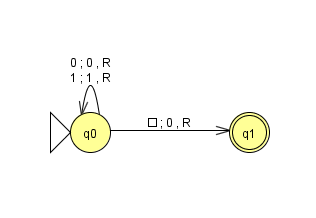

## Trabalho LFA

### Make a turing machine that receives a number in binary and multiply it by two.

### Make a turing machine that receives two numbers in binary and give as output the sum of the two numbers.

### Create a Turing machine to recognize the words of the following language: L = { ww | w ϵ {a, b, c}*}

### Create a Turing machine to recognize all the palindromic words of the language: L = { w | w ϵ {a, b}*}
